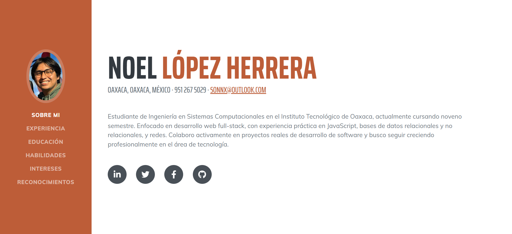
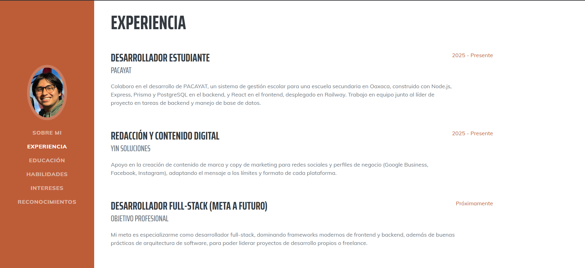
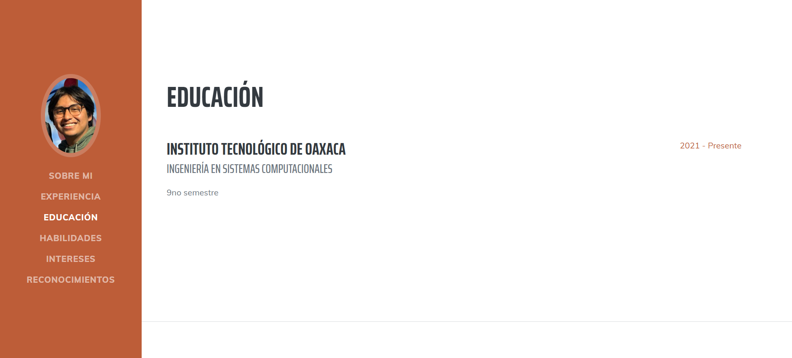
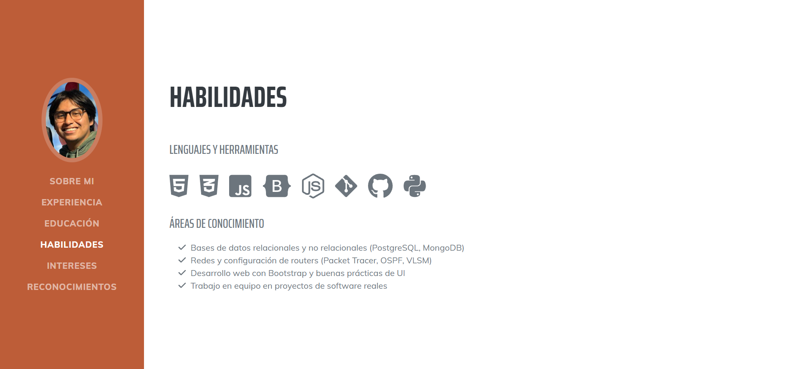
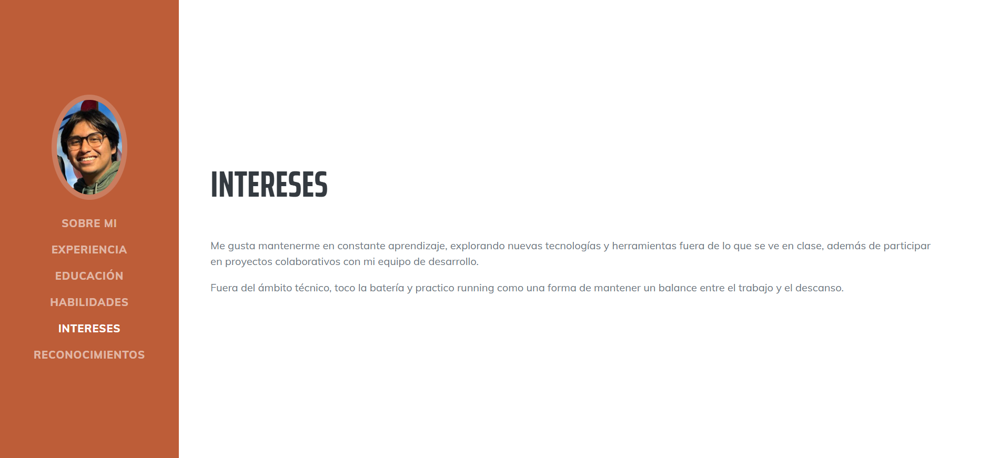
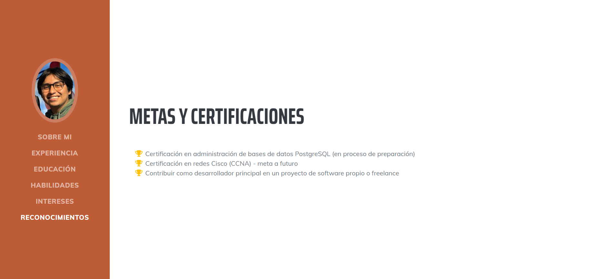

# Portafolio Web - Bootstrap

INSTITUTO TECNOLÓGICO NACIONAL DE MÉXICO
INSTITUTO TECNOLÓGICO DE OAXACA
Ingeniería en Sistemas Computacionales
Programación Web

Actividad 4 - Portafolio Web con Bootstrap
Alumno: López Herrera Noel
Docente: Adelina Martínez Nieto
Grupo: 7SC
Fecha de entrega:  07 de julio del 2026

🔗 **Ver Página en Vivo - GitHub Pages:** https://sonnx18.github.io/portafolio-web/
🔗 **Ver Repositorio:** https://github.com/sonnx18/portafolio-web

---

## ¿Qué es este proyecto?

Un portafolio web personal construido con **HTML, CSS, JavaScript y Bootstrap 5**, a partir de una plantilla ya existente en vez de empezar desde cero. La idea es tener un sitio con mis datos, experiencia y habilidades, listo para compartir como un CV en línea, sin mezclar Bootstrap con otro framework de estilos como Tailwind.

## Framework y plantilla utilizada

- **Framework CSS:** Bootstrap 5
- **Plantilla:** Resume — Start Bootstrap
- **Link de descarga de la plantilla:** https://startbootstrap.com/theme/resume

## Secciones del portafolio

El menú de navegación tiene 6 secciones, cada una accesible con scroll o clic directo:

- **Sobre mí:** presentación general, nombre, datos de contacto y una breve descripción profesional.
- **Experiencia:** mi colaboración en PACAYAT (sistema de gestión escolar) y YIN Soluciones (contenido digital), además de mis metas profesionales a futuro.
- **Educación:** formación académica actual en el Instituto Tecnológico de Oaxaca, Ingeniería en Sistemas Computacionales.
- **Habilidades:** lenguajes, herramientas y áreas de conocimiento técnico (HTML, CSS, JavaScript, Bootstrap, bases de datos, redes, Git).
- **Intereses:** aprendizaje continuo de nuevas tecnologías y trabajo colaborativo en proyectos de desarrollo, además de intereses personales como tocar la batería y correr.
- **Metas:** certificaciones y metas profesionales que busco alcanzar a futuro.

## Proceso de creación

1. Elegí la plantilla **Resume** de Start Bootstrap por su estructura clara de secciones, ideal para un portafolio tipo CV.
2. Descargué la plantilla desde su repositorio oficial en GitHub.
3. Reorganicé la estructura de archivos para cumplir con lo pedido en la actividad:
   - Renombré `styles.css` → `portafolio.css`.
   - Renombré `scripts.js` → `portafolio.js`.
   - Renombré la carpeta `assets/img` a `img`.
   - Actualicé todas las rutas correspondientes en `index.html`.
4. Reemplacé el contenido genérico de la plantilla (nombre, experiencia, educación, etc.) por mi información real.
5. Traduje los textos del menú y de cada sección al español.
6. Agregué mi foto de perfil profesional en la carpeta `img/`.
7. Subí el proyecto a un repositorio público en GitHub y activé GitHub Pages desde la rama `main`.

## Capturas de Pantalla

### Sobre mí

### Experiencia

### Educación

### Habilidades

### Intereses

### Metas

## Tecnologías utilizadas

- HTML5
- CSS3
- JavaScript
- Bootstrap 5
- Font Awesome (íconos)
- GitHub Pages (despliegue)